# AML Transaction Risk Engine

An Anti-Money Laundering (AML) detection system built on a **Neo4j graph database** with a **Bayesian + ML risk scoring engine** that evaluates financial transactions in near real-time.

## Screenshots

### Login
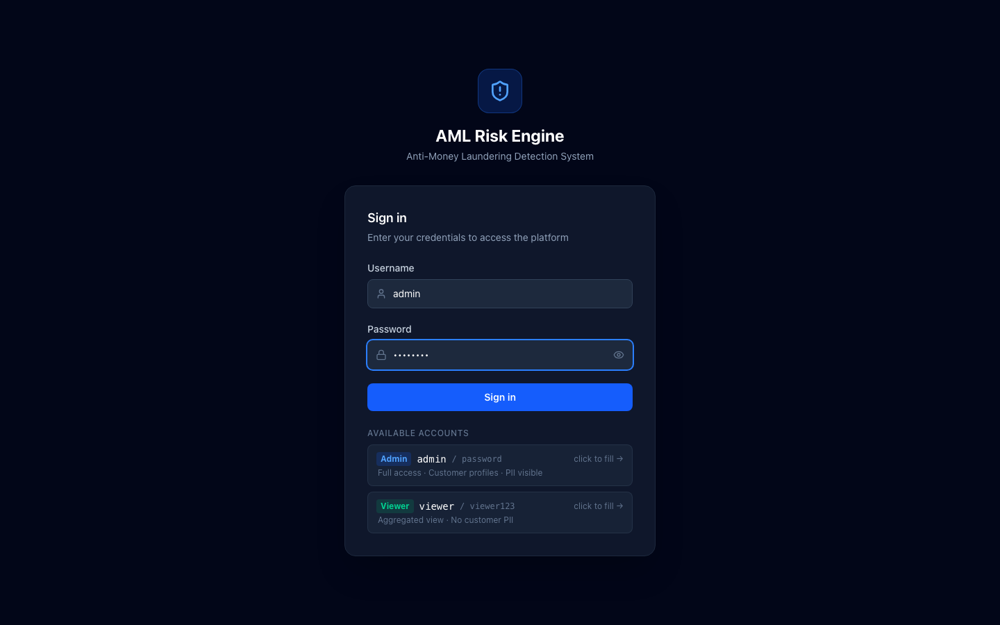

### Dashboard
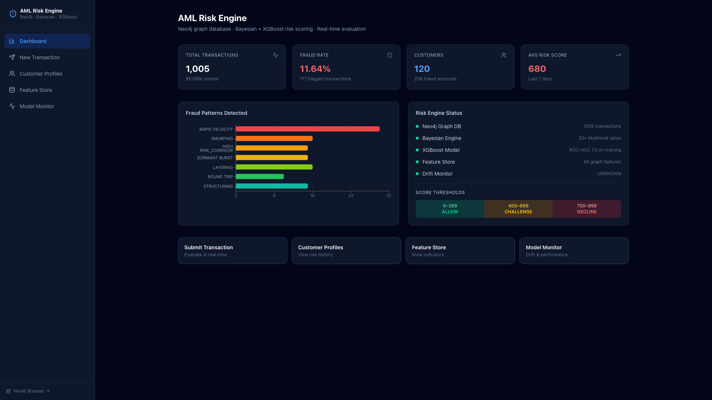

### Dashboard — World Transaction Heatmap
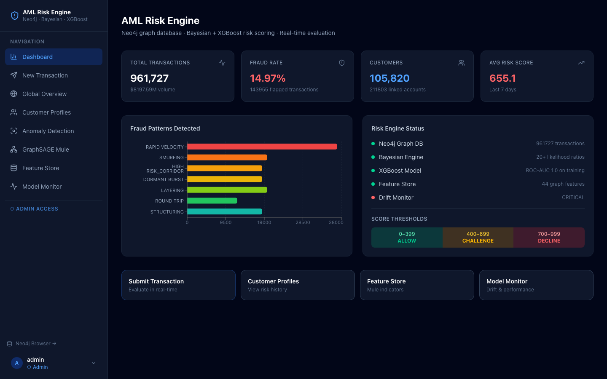

### Global Overview
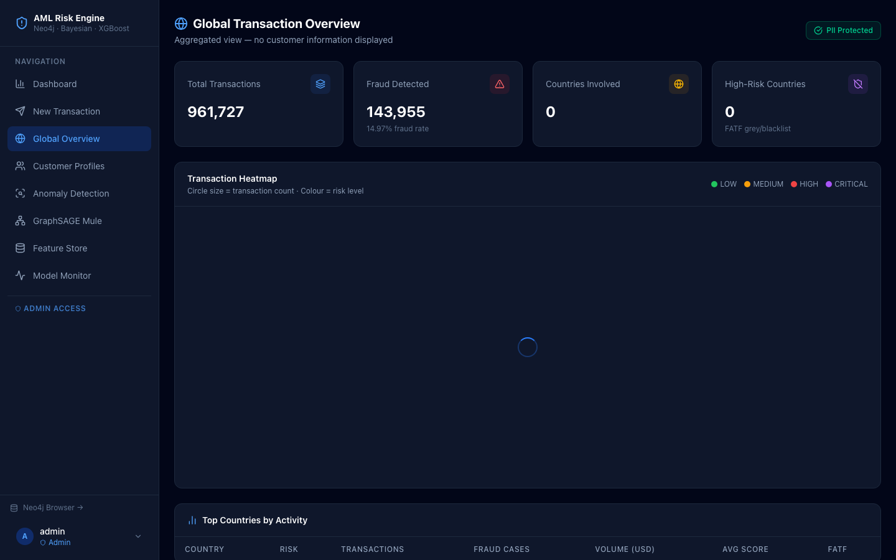

### Submit Transaction
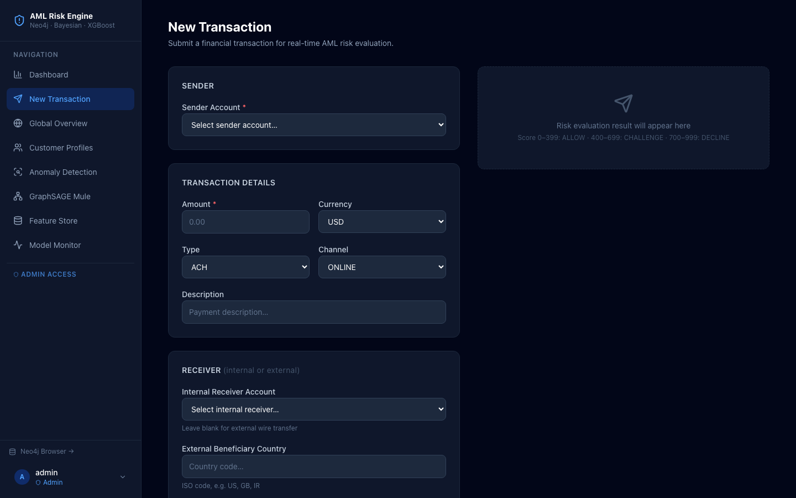

### Customer Profile List
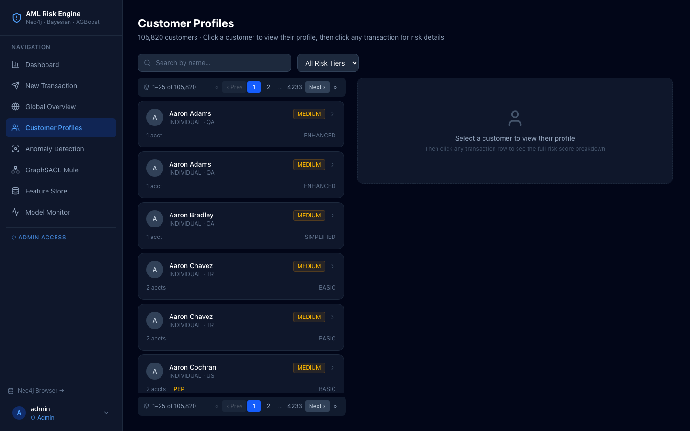

### Customer Detail with Transaction History
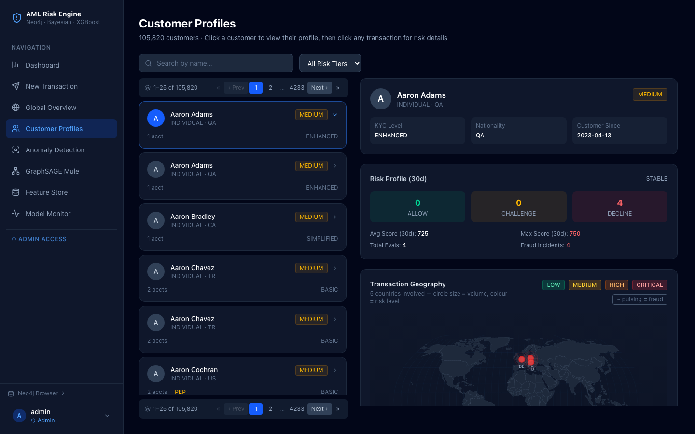

### Transaction Detail & Risk Breakdown
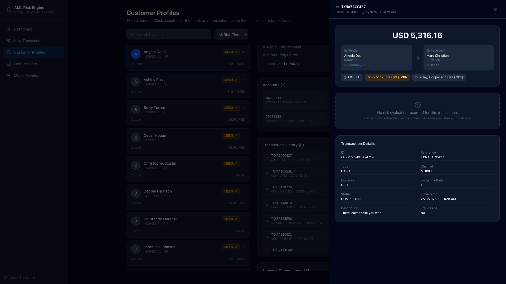

### Model Monitor & Drift Detection
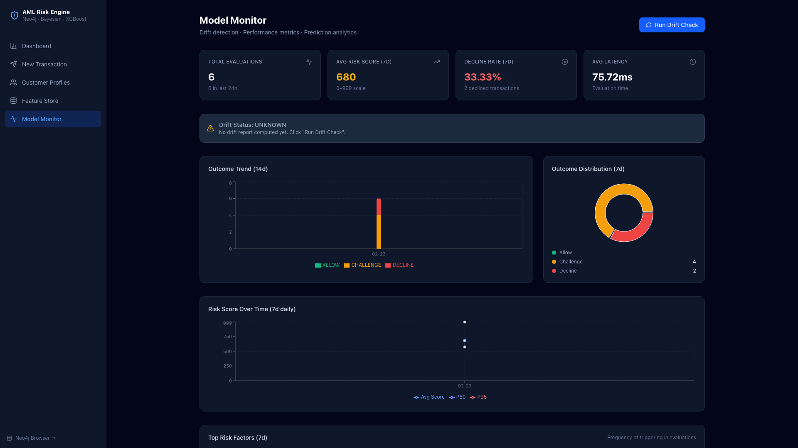

### Model Monitor — Charts
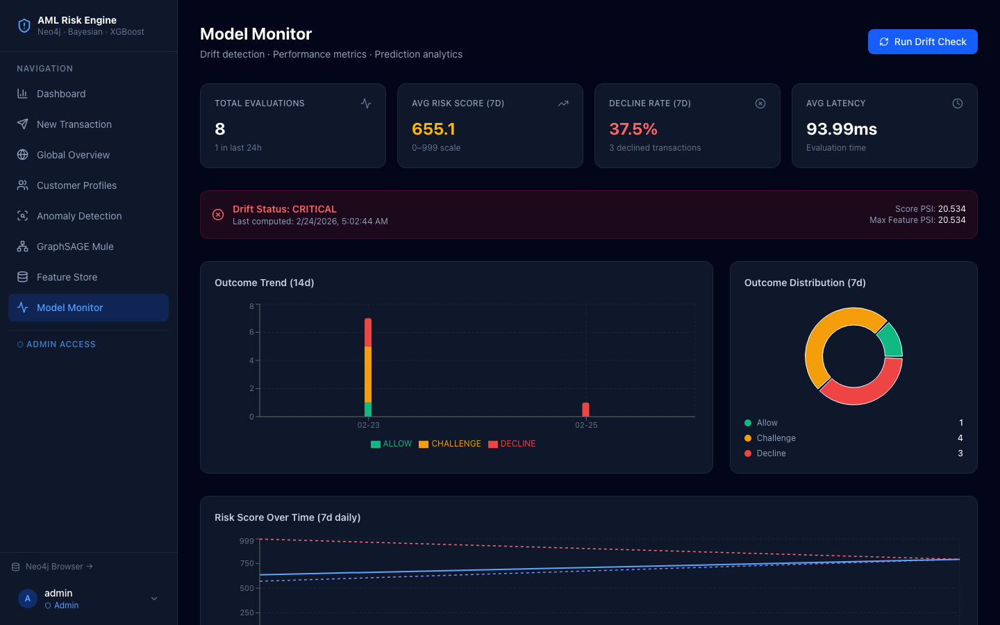

### Feature Store — High-Risk Account Analysis
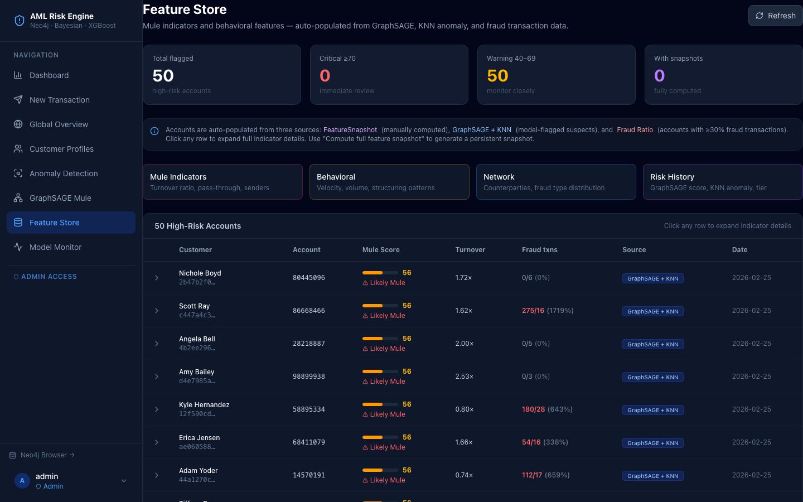

### KNN Anomaly Detection
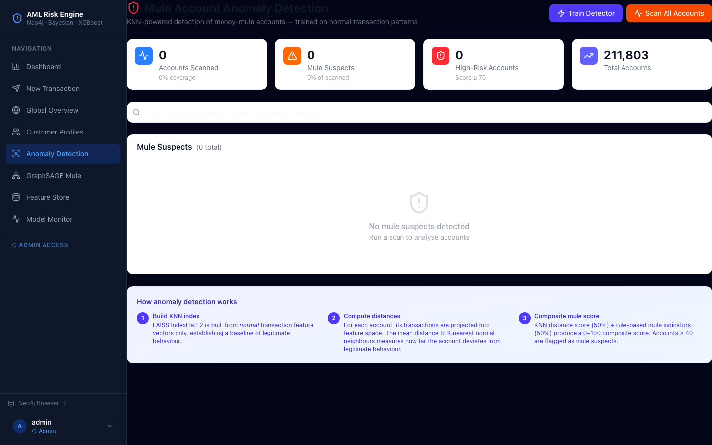

### GraphSAGE Mule Account Detection
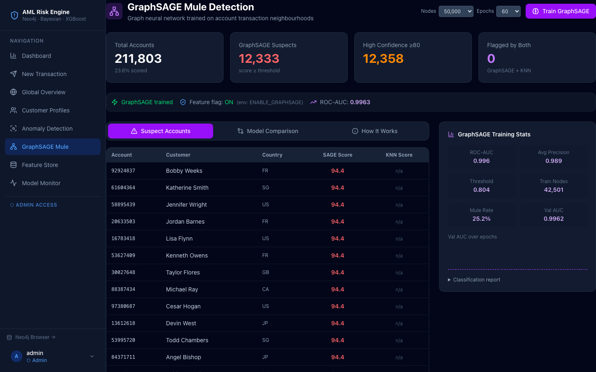

### GraphSAGE — Account Detail (Mule Pattern Badges)
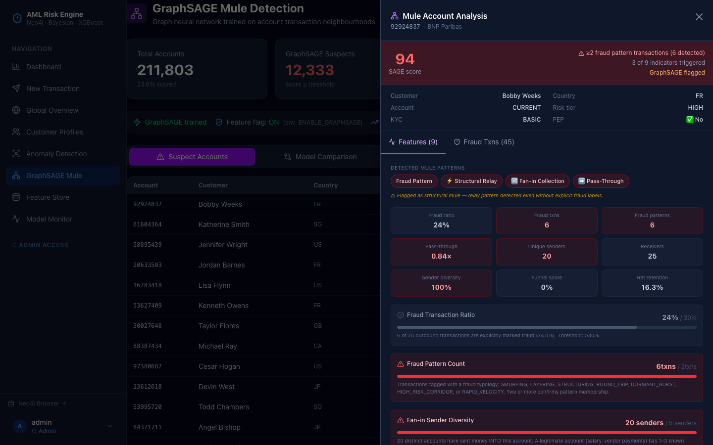

### GraphSAGE — Suspicious Transactions
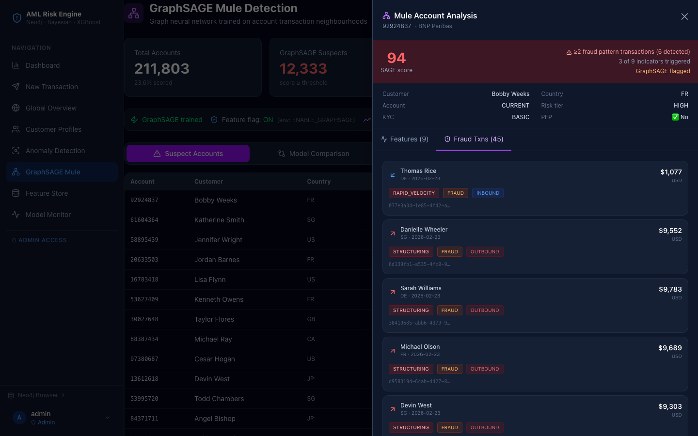

### GraphSAGE — How It Works (Mule Pattern Glossary)
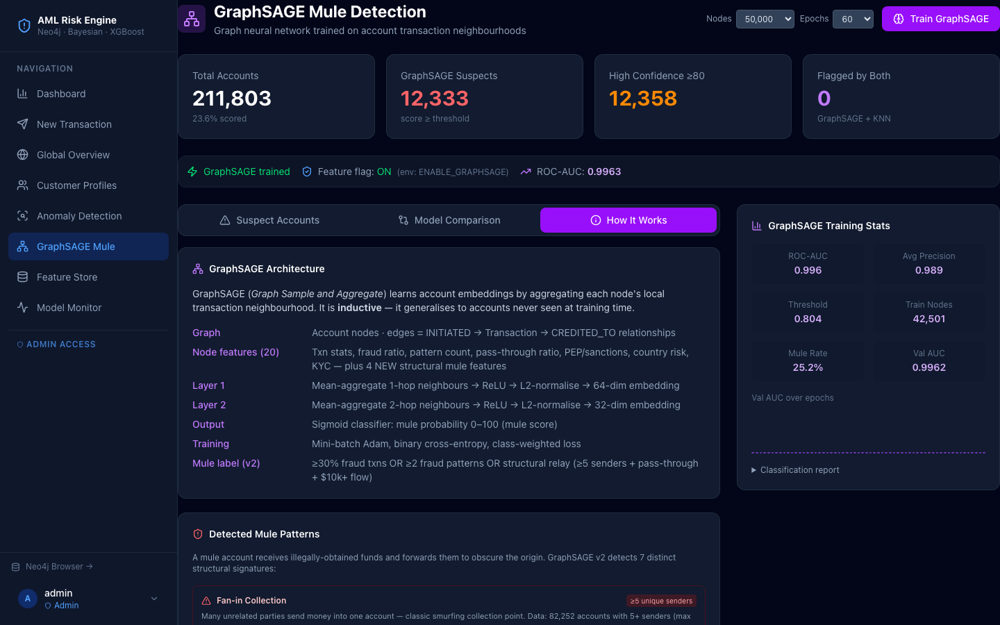

## Architecture

```
┌─────────────────────────────────────────────────────────────┐
│                    FastAPI REST API                          │
│         /evaluate/{txn_id}  |  /transactions/               │
└───────────────────────┬─────────────────────────────────────┘
                        │
              ┌─────────▼──────────┐
              │   Risk Engine       │
              │  (risk/engine.py)   │
              └──────┬──────┬──────┘
                     │      │
          ┌──────────▼──┐  ┌▼──────────────┐
          │  Bayesian    │  │  ML Model      │
          │  Engine      │  │  (XGBoost /    │
          │  (55% weight)│  │  GBT, 45%)     │
          └──────────────┘  └───────────────┘
                     │      │
              ┌──────▼──────▼──────┐
              │   Feature Extractor │
              │  (44 graph features)│
              └──────────┬──────────┘
                         │
              ┌───────────▼───────────┐
              │   Neo4j Graph DB       │
              │                        │
              │  Customer → Account    │
              │     ↓                  │
              │  Account →[INITIATED]→ Transaction │
              │  Transaction →[CREDITED_TO]→ Account│
              │  Transaction →[ORIGINATED_FROM]→ Device│
              │  Transaction →[SOURCED_FROM]→ IPAddress│
              └───────────────────────┘
```

## Graph Data Model

Follows ACAMS / FATF standard financial crime graph patterns.

### Node Labels
| Node | Key Properties |
|------|----------------|
| `Customer` | id, name, nationality, kyc_level, pep_flag, sanctions_flag, risk_tier |
| `Account` | id, account_number, type, currency, balance, bank, status, created_at |
| `Transaction` | id, amount, currency, type, channel, timestamp, is_fraud, fraud_type |
| `Device` | id, fingerprint, device_type |
| `IPAddress` | ip, country, is_vpn, is_tor |
| `Merchant` | id, name, mcc_code, category, country |
| `BeneficiaryAccount` | id, account_number, bank_swift, country |
| `Country` | code, name, fatf_risk, is_sanctioned, is_tax_haven |

### Relationships
```
(Customer)-[:OWNS]->(Account)
(Account)-[:INITIATED]->(Transaction)
(Transaction)-[:CREDITED_TO]->(Account)
(Transaction)-[:PAID_TO]->(Merchant)
(Transaction)-[:ORIGINATED_FROM]->(Device)
(Transaction)-[:SOURCED_FROM]->(IPAddress)
(Transaction)-[:SENT_TO_EXTERNAL]->(BeneficiaryAccount)
(Customer)-[:RESIDENT_OF]->(Country)
(Account)-[:BASED_IN]->(Country)
```

## Risk Scoring

### Score Range: 0–999
| Score | Outcome | Action |
|-------|---------|--------|
| 0–399 | **ALLOW** | Transaction proceeds automatically |
| 400–699 | **CHALLENGE** | Present challenge question / OTP to customer |
| 700–999 | **DECLINE** | Transaction blocked, compliance alerted |

### Bayesian Risk Engine (55% weight)
Uses log-odds Naive Bayes with calibrated likelihood ratios:
- Prior: P(fraud) = 2% (base fraud rate)
- Updates posterior odds via `log(LR)` for each triggered risk factor
- Key LRs: Sanctions match (×50), Tor usage (×20), Structuring (×18–20), Rapid velocity (×12), Dormant account (×6)
- Converts posterior probability → 0–999 via sigmoid scaling

### ML Model (45% weight)
- **Algorithm**: XGBoost gradient boosting (sklearn GBT fallback)
- **Features**: 44 graph-derived features including velocity, network hops, geographic risk, behavioural deviation
- **Training data**: 1,000 seeded transactions with 7 fraud typologies (~15% fraud rate)
- **Imbalance handling**: `scale_pos_weight=5` (XGBoost) + threshold calibration via PR-curve F1

## Fraud Patterns in Seed Data

| Pattern | Description | Count |
|---------|-------------|-------|
| **Structuring** | Multiple txns just below $10,000 CTR threshold | ~15 |
| **Smurfing** | Multiple sources aggregating to one account | ~16 |
| **Layering** | Chain A→B→C→D→E rapid fund movement | ~16 |
| **Round-tripping** | Money leaves and returns to origin within 48h | ~10 |
| **Dormant Burst** | Long-dormant account suddenly active | ~15 |
| **High-Risk Corridor** | Transfers to FATF grey/blacklisted countries | ~15 |
| **Rapid Velocity** | 10+ transactions from one account within 1 hour | ~30 |

## Quick Start

### 1. Start Neo4j
```bash
docker-compose up -d
# Wait ~30s for Neo4j to initialise
```

### 2. Install Python dependencies
```bash
python -m venv venv
source venv/bin/activate   # Windows: venv\Scripts\activate
pip install -r requirements.txt
```

### 3. Run setup (generates data + trains model)
```bash
python scripts/setup.py
```

### 4. Start the API
```bash
uvicorn api.main:app --reload --port 8000
```

### 5. Open docs
- **API Swagger UI**: http://localhost:8000/docs
- **Neo4j Browser**: http://localhost:7474 (neo4j / amlpassword123)

## API Endpoints

### Evaluate a stored transaction
```bash
POST /evaluate/{txn_id}
```

### Evaluate a transaction inline (pre-storage)
```bash
POST /evaluate/inline/evaluate
{
  "sender_account_id": "abc-123",
  "amount": 9500,
  "currency": "USD",
  "transaction_type": "WIRE",
  "beneficiary_country": "IR",
  "ip_is_tor": true
}
```

### Batch evaluation
```bash
POST /evaluate/batch/evaluate
["txn-id-1", "txn-id-2", "txn-id-3"]
```

### Run the demo
```bash
python scripts/demo.py
```

## Useful Neo4j Queries

```cypher
// All fraud transactions
MATCH ()-[:INITIATED]->(t:Transaction {is_fraud: true})
RETURN t.fraud_type, count(*) ORDER BY count(*) DESC

// Fund flow path for a transaction
MATCH path = (c:Customer)-[:OWNS]->(a:Account)-[:INITIATED]->(t:Transaction)-[:CREDITED_TO]->(b:Account)
WHERE t.id = 'your-txn-id'
RETURN path

// High-risk corridors
MATCH (t:Transaction)-[:SENT_TO_EXTERNAL]->(b:BeneficiaryAccount)
MATCH (c:Country {code: b.country})
WHERE c.fatf_risk IN ['HIGH', 'BLACKLIST']
RETURN b.country, count(t) AS count ORDER BY count DESC

// Structuring pattern detection
MATCH (a:Account)-[:INITIATED]->(t:Transaction)
WHERE t.amount >= 9000 AND t.amount < 10000
WITH a, count(t) AS structuring_count
WHERE structuring_count >= 2
RETURN a.id, a.account_number, structuring_count ORDER BY structuring_count DESC
```

## Project Structure

```
moneylaundringexpriment/
├── docker-compose.yml          # Neo4j 5.15 with APOC + GDS plugins
├── requirements.txt
├── .env                        # Neo4j credentials, thresholds
├── config/settings.py          # Pydantic settings
├── db/
│   ├── client.py               # Neo4j driver + session context manager
│   ├── schema.py               # Cypher constraints, indexes, query templates
│   └── models.py               # Pydantic models for all graph entities
├── data/
│   └── generator.py            # 1000-transaction data generator
├── risk/
│   ├── features.py             # 44-feature extractor from graph context
│   ├── bayesian.py             # Bayesian log-odds risk engine
│   └── engine.py               # Orchestrator: extract→score→decide
├── ml/
│   ├── model.py                # XGBoost/GBT model wrapper
│   └── train.py                # Training pipeline
├── api/
│   ├── main.py                 # FastAPI app
│   └── routes/
│       ├── transactions.py     # CRUD + stats endpoints
│       └── evaluate.py         # Risk evaluation endpoints
├── scripts/
│   ├── setup.py                # Full setup: schema + data + train
│   └── demo.py                 # Interactive demo
└── models_saved/               # Trained model artifacts (joblib)
```
